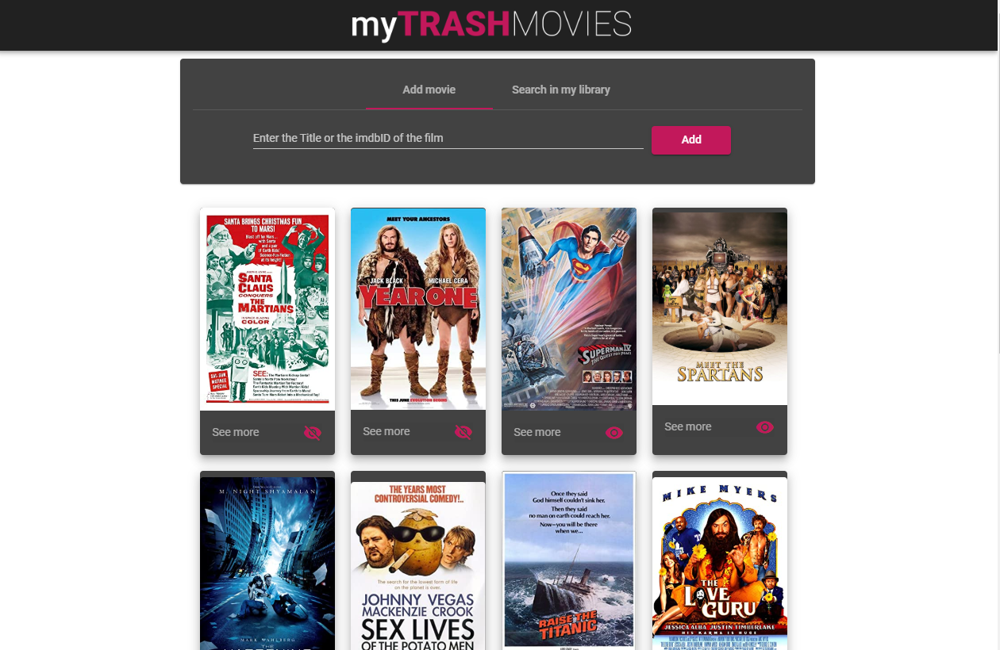
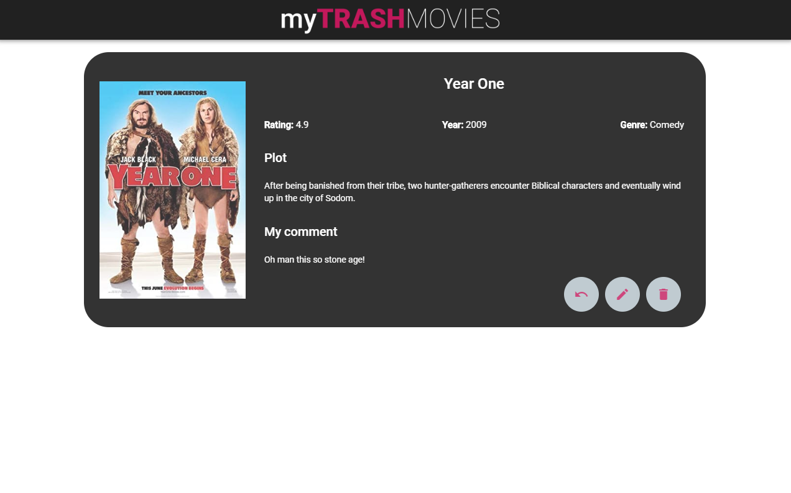

<h1 align="center" background-color="black">
  
</h1>

<h1 align="center">
  

    
    
  

    
</h1>

### 📜 Sobre
O myTRASH MOVIES foi desenvolvido com o intuito de se aventurar pela primeira vez com Angular e Nestjs, ele é composto por uma aplicação web em Angular e uma API REST (Nestjs) como backend. 

O objetivo da aplicação é permitir o usuario cadastrar filmes ruins, ou seja filmes que sejam abaixo de uma nota de corte definido na aplicação, a note de corte é baseada no rating do filme no IMDB. O usuário pode informar o nome do filme (em inglês) ou o imdbId que pode ser encontrado na url do filme no site do IMDB, além do cadastro o usuário pode ordenar esses filmes na biblioteca e ver detalhes, podendo adicionar um comentário e definir como assistido ou não assistido. 

### 🔽 Requisitos
1. Ter o **NodeJS**, **Nest**, e o **NgCLI** instalado

### :rocket: Começando
1. ``git clone https://github.com/Negreyscow/MyTrashFilms``
2. ``cd MyTrashFilms``

### :rocket: Iniciando com o backend
1. ``cd backend``
2.  ``npm install``
3. ``npm start:dev``

### 💻 Iniciando com o Front-end 
1. ``cd frontend``
2.  ``npm install``
3. ``ng serve``

### 🧰  Ferramentas utilizadas
- ⚛️ **Angular 9** - Biblioteca Javascript para criar interfaces de usuário.
- ⚛️ **Nestjs** - Nodejs Framework.
- ⚙️ **MongoDB** - Banco de dados.

 por Leonardo Caracho 

